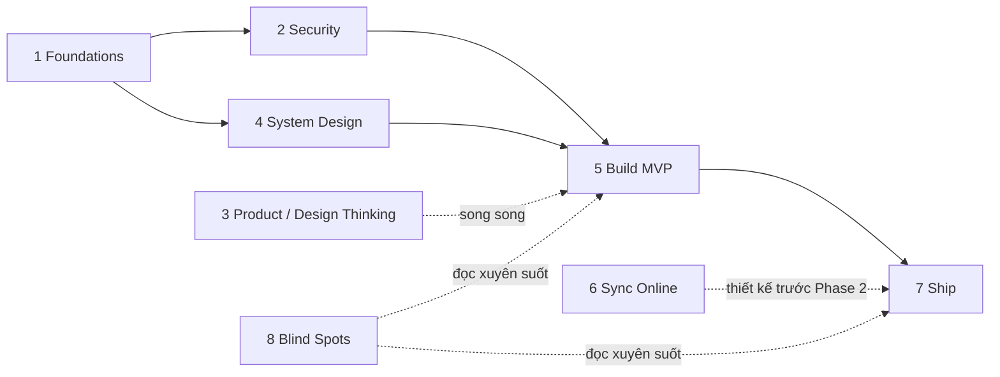

# Giáo trình VipaVault — Tự xây dựng đến khi ship sản phẩm

> **Mục tiêu:** Tự tay xây VipaVault từ spec đến **sản phẩm ship được cho người dùng thật** (V1 release 0.10.0 + nền tảng Phase 2/3), **không phụ thuộc AI agent**. MVP chỉ là một chương (Module 5) — giáo trình đi tiếp đến packaging, code signing, auto-update, vận hành và mở rộng sync online.
>
> **Đối tượng:** Developer đã biết lập trình cơ bản, muốn làm chủ toàn bộ stack Tauri/Rust/React/SQLCipher và tư duy sản phẩm đi kèm.
>
> **Ngày tạo:** 2026-07-13 · Gắn với spec [`vipavault-spec.md`](../vipavault-spec.md), roadmap [`MILESTONES_REFERENCE.md`](../../.context/planning/MILESTONES_REFERENCE.md) (đã reorder dogfood-first), phản biện [`pm-review-solutions.md`](../reviews/pm-review-solutions.md).

---

## Triết lý giáo trình

1. **Project-based:** không học "hết Rust rồi mới code" — mỗi module học đúng phần cần cho milestone kế tiếp, làm bài tập trên chính repo VipaVault.
2. **Đọc → Làm → Viết:** mỗi module kết thúc bằng việc **tự viết** một tài liệu ngắn (ADR, threat model, journal) — nếu không viết ra được nghĩa là chưa hiểu.
3. **Câu hỏi trước code:** mỗi module có danh sách "câu hỏi phải trả lời được" — trả lời bằng lời của mình trước khi gõ code.
4. **Ship là kỹ năng riêng:** code chạy trên máy dev ≠ sản phẩm. Module 7–8 tồn tại vì lý do đó.

## Lộ trình

| Module | File | Nội dung | Ước tính* |
|--------|------|----------|-----------|
| 1 | [01-foundations.md](01-foundations.md) | Rust, TypeScript/React, Tauri 2, SQLite — nền tảng đúng phần cần | 4–6 tuần |
| 2 | [02-security-crypto.md](02-security-crypto.md) | Mật mã ứng dụng: Argon2id, SQLCipher, key lifecycle, threat modeling | 2–3 tuần |
| 3 | [03-product-design-thinking.md](03-product-design-thinking.md) | Design thinking, JTBD, kiểm chứng persona, viết ADR, kỷ luật scope | 1–2 tuần (song song) |
| 4 | [04-system-design.md](04-system-design.md) | Kiến trúc desktop, IPC, data modeling, provider abstraction, migrations | 2 tuần |
| 5 | [05-build-mvp.md](05-build-mvp.md) | Xây V1 theo 11 milestone (0.1.0 → 0.10.0), mốc dogfood 0.6.0 | 8–14 tuần |
| 6 | [06-sync-online.md](06-sync-online.md) | 6 hướng sync online — pros/cons, key management đa thiết bị, CRDT | 1–2 tuần (đọc + thiết kế) |
| 7 | [07-ship-beyond-mvp.md](07-ship-beyond-mvp.md) | Packaging, code signing, auto-update, release engineering, Phase 2/3 | 3–4 tuần |
| 8 | [08-blind-spots.md](08-blind-spots.md) | Những điểm mù thường bỏ sót — bảo mật bộ nhớ, pháp lý VN, vận hành solo | Đọc xuyên suốt |

*Giả định 10–15 giờ/tuần. Tổng thô: **5–8 tháng** part-time đến bản ship V1; Phase 2/3 cộng thêm 2–4 tháng.

## Sơ đồ phụ thuộc

## Cách dùng cùng tài liệu dự án

| Khi nào | Đọc gì |
|---------|--------|
| Mọi câu hỏi scope/tính năng | `docs/vipavault-spec.md` (source of truth) |
| "Tại sao chọn X?" | `docs/technical-decisions.md` + `.context/decisions/` |
| Bắt đầu một milestone | `.context/planning/MILESTONES_REFERENCE.md` — goal, deliverables, exit criteria |
| Rủi ro/quyết định đang mở | `docs/reviews/pm-review-solutions.md` |

## Quy tắc tự học không cần agent

1. **Chặn copy-paste mù:** mọi đoạn code chép từ docs/tutorial phải gõ lại tay và sửa ít nhất 1 thứ (đổi tên, thêm test) để ép đọc hiểu.
2. **Journal hàng tuần:** 10 dòng — học gì, kẹt gì, quyết định gì. Đây là thay thế cho "hỏi AI" — viết ra thường tự thấy câu trả lời (rubber duck debugging).
3. **Mỗi bug > 2 giờ:** viết post-mortem 5 dòng (triệu chứng → giả thuyết sai → nguyên nhân thật → cách phát hiện nhanh hơn lần sau).
4. **Exit criteria là hợp đồng:** không chuyển module/milestone khi checklist chưa xanh — kể cả "gần xong".

## Tài liệu nền chung (mua/đọc một lần, dùng cả giáo trình)

| Tài liệu | Vai trò | Link |
|----------|---------|------|
| The Rust Programming Language ("The Book") | Nền Rust chính thức, miễn phí | https://doc.rust-lang.org/book/ |
| Designing Data-Intensive Applications (Kleppmann) | Nền data system — dùng ở Module 4, 6 | https://dataintensive.net/ |
| The Mom Test (Fitzpatrick) | Kiểm chứng nhu cầu người dùng — Module 3 | https://www.momtestbook.com/ |
| Tauri 2 Documentation | Docs chính thức framework | https://v2.tauri.app/ |
| OWASP Cheat Sheet Series | Chuẩn bảo mật ứng dụng — Module 2, 8 | https://cheatsheetseries.owasp.org/ |
