# Quyết định kỹ thuật — VipaVault

> **Đối tượng:** Developer (ưu tiên). Agent có thể đọc file này để nắm bối cảnh, nhưng **source of truth chi tiết** vẫn là `docs/vipavault-spec.md` và `.context/`.
>
> **Cập nhật:** 2026-06-18 · Foundation **0.1.0 done** · Chờ activate **0.1.1**

---

## 1. Mục đích tài liệu

Tài liệu này ghi lại **các quyết định đã chốt** — không phải brainstorm. Mỗi mục gồm:

- **Vấn đề** cần giải quyết
- **Phương án đã chọn** và phương án bị loại
- **Lý do** (trade-off thực tế)
- **Ràng buộc** — không được phá trừ khi mở tension mới

Chi tiết vault storage (SQLCipher vs KeePass): [`.context/decisions/DECISION_VAULT_STORAGE.md`](../.context/decisions/DECISION_VAULT_STORAGE.md).

---

## 2. Tổng quan kiến trúc

VipaVault là **desktop app** (không phải web SaaS): Tauri 2 bọc React SPA, logic nhạy cảm chạy trong Rust.

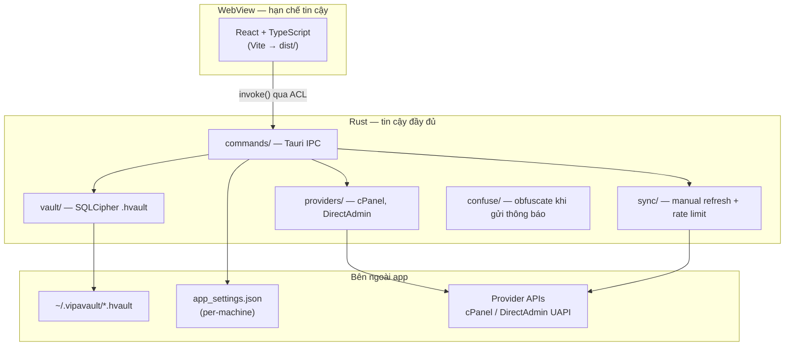

### Stack đã chốt

| Lớp | Công nghệ | Ghi chú |
|-----|-----------|---------|
| Shell | Tauri 2.x | Cross-platform desktop |
| Backend | Rust 2021 | `src-tauri/` |
| Frontend | React 18 + TypeScript + Vite | **Không** Next.js, không SSR |
| Storage | SQLCipher (`.hvault`) | Toàn file AES-256-GCM |
| KDF | Argon2id | Milestone 0.1.1 |
| License | AGPL-3.0 | Xem `LICENSE` |

---

## 3. SIMPLE V1 — Auth & chia sẻ

Human approve 2026-06. Đây là ranh giới sản phẩm cho toàn Phase V1.

### 3.1 Đăng nhập

**Tách backend và UI** — hay nhầm lẫn ở đây:

| Lớp | Quy tắc |
|-----|---------|
| **Backend** | Chỉ **master password** là yếu tố knowledge để mở SQLCipher. 1 vault → không cần chọn profile; ≥2 vault → cần `profile_id` / path. |
| **UI (màn login)** | Luôn hiển thị theo thứ tự: **tên vault** → **tên người dùng** → **ô mật khẩu**. Hai dòng đầu là ngữ cảnh (read-only), không thay thế xác thực. |

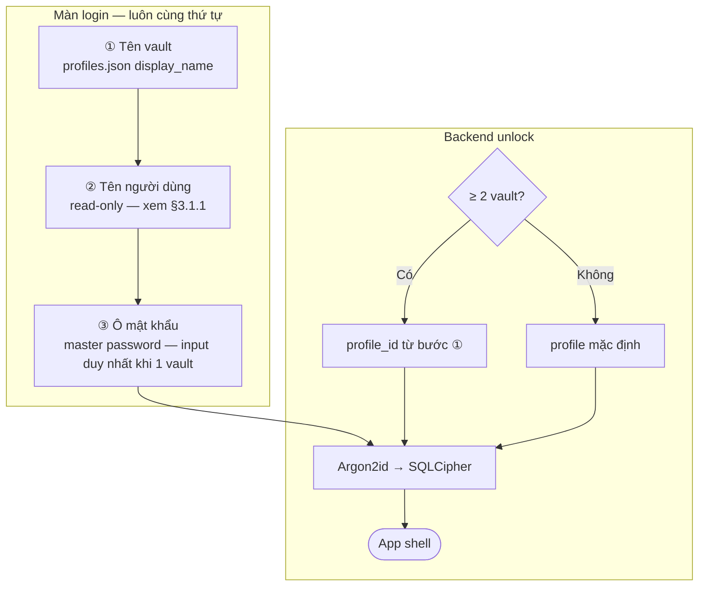

#### 3.1.1 Nguồn hiển thị trên UI

| Field UI | 1 vault | ≥ 2 vault | Nguồn dữ liệu |
|----------|---------|-----------|----------------|
| Tên vault | Label read-only | Dropdown / select | `profiles.json` → `display_name` |
| Tên người dùng | Label read-only | Label read-only | `app_settings.json` → `operator_display_name`; fallback tên OS user |
| Mật khẩu | Input | Input | User nhập — **không lưu** |

```
1 vault (UI):
┌──────────────────────────────────┐
│ Vault:      Công ty A            │  ← read-only
│ Người dùng: Tuấn (IT)            │  ← read-only
│ Mật khẩu:   [ •••••••••••••••• ] │  ← input duy nhất (backend)
│         [ Mở khóa ]              │
└──────────────────────────────────┘

≥ 2 vault (UI):
┌──────────────────────────────────┐
│ Vault:      [ Công ty A      ▼ ] │
│ Người dùng: Tuấn (IT)            │
│ Mật khẩu:   [ •••••••••••••••• ] │
│         [ Mở khóa ]              │
└──────────────────────────────────┘
```

| Chốt | Không làm trong V1 |
|------|-------------------|
| Backend: chỉ master password mở `.hvault` | Email login, user account + `password_hash` |
| UI: luôn có tên vault + tên người dùng **trước** ô pass | Ẩn tên vault khi 1 profile |
| ≥2 vault: dropdown **chỉ** ở dòng tên vault | PIN quick unlock |
| | `workspace_members`, allowlist email |
| | Remember email / `last_login_email` |

### 3.2 Vai trò & chia sẻ file

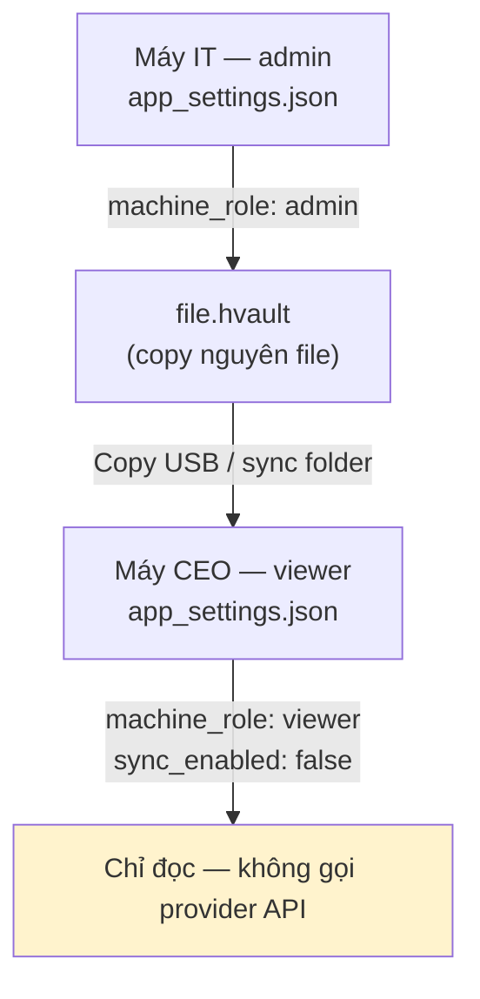

| Chốt | Không làm trong V1 |
|------|-------------------|
| `machine_role` + `sync_enabled` trong `app_settings.json` **ngoài vault** | Share Package wizard |
| Chia sẻ = copy **toàn bộ** `.hvault` | Partial vault export |
| Viewer: UI + backend chặn write | Activation-code claim |
| Audit: `activity_log.actor_note` | `actor_email` |

Chi tiết FULL extension: `.context/planning/MILESTONE_QUESTIONNAIRE.md` §Auth.

---

## 4. Lưu trữ & mã hóa

### 4.1 SQLCipher — không KeePass backend

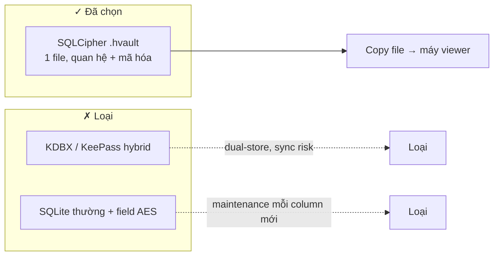

**Lý do chính:** Use case “copy `.hvault` sang máy sếp” đơn giản với file-level encryption; dashboard, sync, audit, confuse đều cần SQL quan hệ native.

### 4.2 Phân tầng dữ liệu (3 lớp)

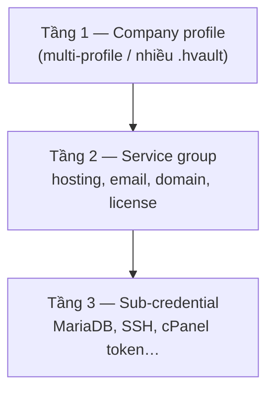

Implement qua **FK trong SQL + UI tree** — không map sang KDBX groups.

### 4.3 Invariants bảo mật (luôn áp dụng)

- Master password **không** lưu ở đâu trong app
- Key material clear bằng **`zeroize`** — không dùng `drop()` thay thế (từ 0.1.1)
- **Không** log credential kể cả debug
- cPanel/DirectAdmin: chỉ **API Token** — không main password

---

## 5. Provider & đồng bộ

### 5.1 Routing V1

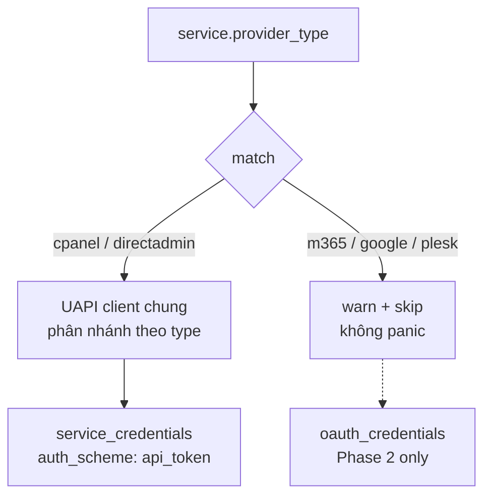

| `provider_type` | `auth_scheme` | Bảng credential | Phase |
|-----------------|---------------|-----------------|-------|
| `cpanel` | `api_token` | `service_credentials` | V1 |
| `directadmin` | `api_token` | `service_credentials` | V1 |
| `m365` | `oauth2_client_credentials` | `oauth_credentials` | 2 |
| `google_workspace` | `oauth2_service_account` | `oauth_credentials` | 2 |

### 5.2 Sync — manual only

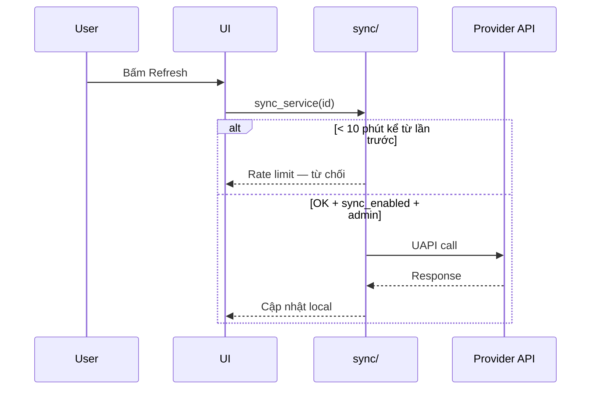

**Lý do:** cPanel không công bố rate limit policy; block IP = mất toàn bộ access hosting. Auto-sync 15 phút → risk không đối xứng.

**Ràng buộc:** Tối đa **1 lần / 10 phút / service**; không auto-sync nền.

---

## 6. Foundation 0.1.0 — Quyết định đã implement

Milestone **0.1.0 done** (2026-06-18). Các quyết định dưới đây ảnh hưởng trực tiếp cách dev làm việc hàng ngày.

### 6.1 Tách `lib.rs` / `main.rs` — cargo test độc lập `dist/`

**Vấn đề:** `tauri::generate_context!()` cần `dist/` → `cargo test` fail nếu chưa `npm run build`.

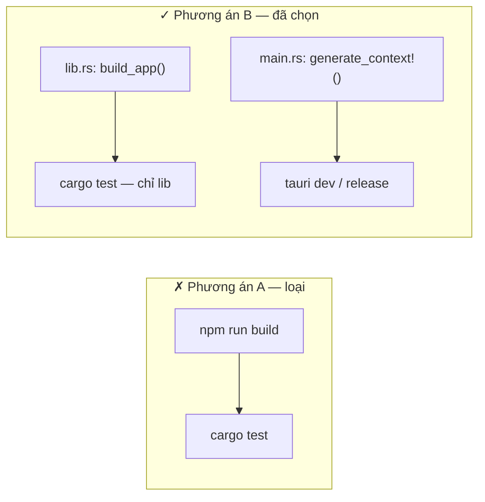

| File | Trách nhiệm |
|------|-------------|
| `src-tauri/src/lib.rs` | `build_app()`, `app_info()`, unit tests |
| `src-tauri/src/main.rs` | Chỉ `generate_context!()` + `run()` |
| `Cargo.toml` | `[[bin]] test = false` — bin không chạy trong test harness |

**Hệ quả:** `npm run verify` = Vitest + `cargo test` **không** cần build frontend trước. `npm run build` / `build:check` vẫn bắt buộc cho `tauri dev` và release.

### 6.2 Tauri Capabilities — least privilege

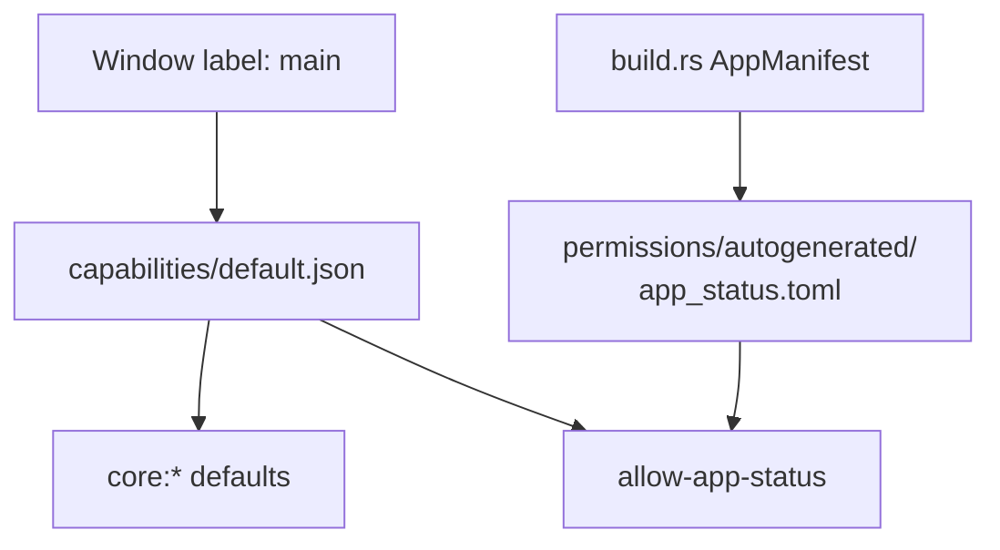

- Mọi IPC command mới → khai báo trong `build.rs` `AppManifest::commands(&[...])`
- Permission tương ứng trong `capabilities/` — **không** `allow-all`
- CSP: `null` ở 0.1.0; siết ở **0.3.0** khi có UI thật

### 6.3 Chiến lược test

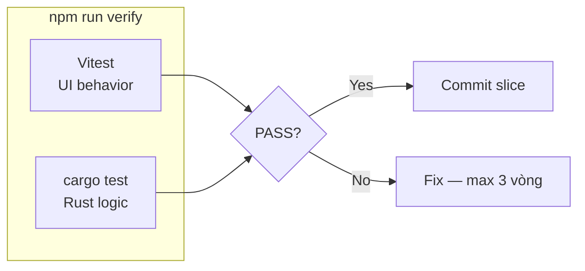

| Lớp | Tool | Foundation coverage |
|-----|------|---------------------|
| Rust | `cargo test` | `app_info`, `build_app`, `app_status` |
| React | Vitest + Testing Library | Boot panel `data-testid="app-version"` |
| IPC integration | Mock Tauri | Từ 0.3.0 |
| E2E | — | Post-MVP |

**TDD bắt buộc:** RED → GREEN → REFACTOR mỗi slice.

### 6.4 Cấu trúc module Rust (hiện tại)

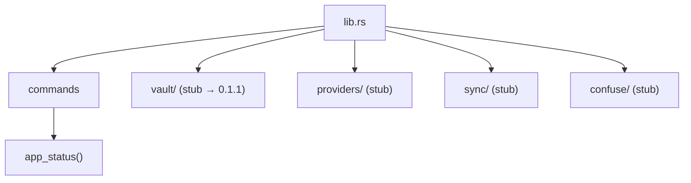

Stub có chủ đích — product logic theo milestone, không implement sớm trong 0.1.0.

### 6.5 Dev environment

| Quyết định | Chi tiết |
|------------|----------|
| Dev OS | **WSL Debian** (không cài toolchain vào repo) |
| Node | 24.x via nvm |
| Vite dev port | **1420** (`tauri.conf.json` `devUrl`) |
| App data | `~/.vipavault/` — ngoài git |
| `docs/` | Tracked trong git (spec, tài liệu này) |
| `dist/` | Gitignored — sinh bởi `npm run build` |

Lệnh chuẩn trên máy dev: `.local/ENVIRONMENT.md` (gitignored, per-machine).

### 6.6 Context map (dev + agent)

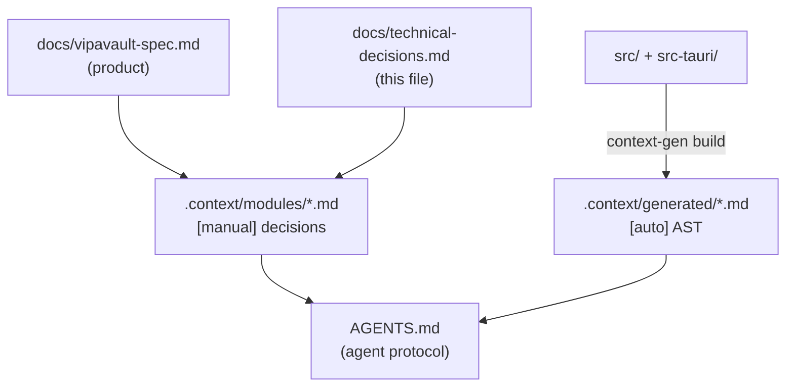

- **Dev đọc trước:** spec → file này → module liên quan
- **Agent đọc thêm:** `AGENTS.md`, `MILESTONES.md`, tensions
- **Không sửa tay** phần `<!-- AUTO_START -->` trong generated

---

## 7. Vai trò per-machine (không user account)

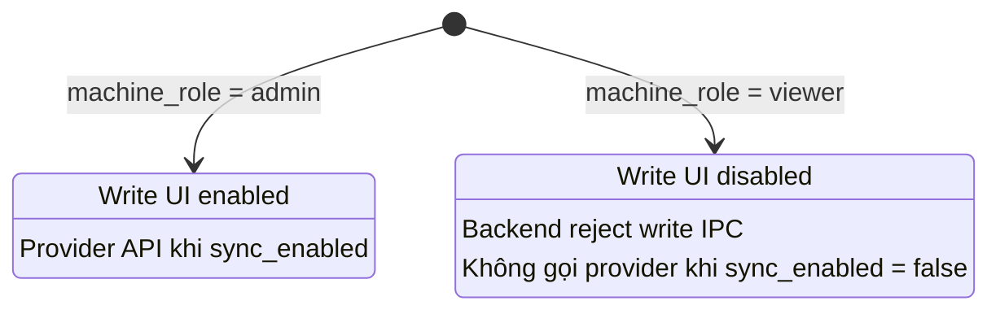

**Lý do:** Chỉ 2 persona thực tế (IT + CEO). User account system = over-engineering.

---

## 8. Confuse engine (preview — 0.10.0)

| Chốt | Chi tiết |
|------|----------|
| Vault lưu password **thật** | Không lưu confuse string |
| Confuse chỉ sinh lúc gửi thông báo | Prefix/suffix từ `app_settings` |
| `confuse_used` trong `activity_log` | Audit sau khi gửi |

---

## 9. Việc cố ý hoãn (deferred)

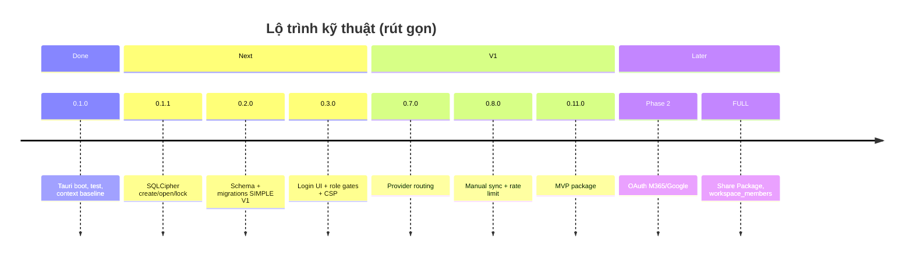

| Hạng mục | Milestone / Phase | Ghi chú |
|----------|-------------------|---------|
| Vault crypto | 0.1.1 | Argon2id, SQLCipher, zeroize |
| CI GitHub Actions | Optional S7 | Q-0.1.0-005 defer |
| ESLint flat config | F-02 | Cuối foundation |
| `clippy` trong verify | F-03 | Khuyến nghị → bắt buộc 0.1.1 exit |
| CSP strict | 0.3.0 | F-05 |
| OAuth flow | Phase 2 | Schema có chỗ, runtime chưa |
| Share Package | Post 0.11.0 | `TD-SHARE-*` |
| KDBX import/export | Phase 2+ optional | Không thay Share Package |

---

## 10. Bảng tra cứu nhanh

| Câu hỏi | Trả lời ngắn |
|---------|--------------|
| Tại sao không Next.js? | Desktop Tauri + Vite SPA — không cần SSR/RSC |
| `cargo test` cần `dist/` không? | **Không** (phương án B) |
| `tauri dev` cần gì? | `npm run build` hoặc `npm run dev` (Vite :1420) |
| Credential OAuth lưu đâu? | `oauth_credentials` — Phase 2, không `service_credentials` |
| Viewer có sync được không? | Chỉ khi `sync_enabled: true` **và** admin policy cho phép — mặc định viewer copy file + `sync_enabled: false` |
| Login UI 1 vault chỉ 1 ô pass? | **Backend** đúng; **UI** vẫn hiện tên vault + tên người dùng trước ô pass |
| Spec conflict với code? | **Sửa code**; sửa spec → tension HIGH |
| Agent có tự activate milestone không? | **Không** — human activate |

---

## 11. Tài liệu liên quan

| Tài liệu | Đối tượng | Nội dung |
|----------|-----------|----------|
| [`vipavault-spec.md`](vipavault-spec.md) | Dev + PM | Product spec đầy đủ |
| File này | **Dev** (agent tham khảo) | Quyết định kỹ thuật đã chốt |
| [`README.md`](../README.md) | Dev mới | Quick start WSL |
| [`.context/decisions/`](../.context/decisions/) | Dev + agent | Decision records chi tiết |
| [`.context/MILESTONES.md`](../.context/MILESTONES.md) | Agent + lead | Execution boundary |
| [`AGENTS.md`](../AGENTS.md) | Agent | Protocol bắt buộc cho agent |
| [`.context/planning/FOUNDATION_WORKFLOW.md`](../.context/planning/FOUNDATION_WORKFLOW.md) | Dev + agent | Tiêu chuẩn foundation, AUTO→MANUAL |

---

## 12. Lịch sử cập nhật

| Ngày | Thay đổi |
|------|----------|
| 2026-06-18 | Khởi tạo — tổng hợp quyết định 0.1.0 + SIMPLE V1 + tensions active |
| 2026-06-18 | §3.1 — sửa login UI: vault name + user name trước ô pass; backend 1 vault vẫn chỉ cần password |